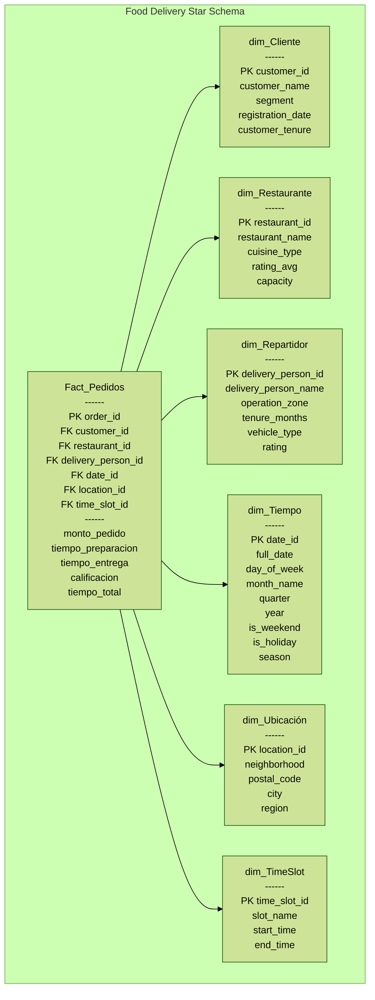

```mermaid
%%{init: {'theme': 'forest'}}%%
graph TD
    subgraph "Food Delivery Star Schema"
        
    FACT[Fact_Pedidos<br/>------<br/>PK order_id<br/>FK customer_id<br/>FK restaurant_id<br/>FK delivery_person_id<br/>FK date_id<br/>FK location_id<br/>FK time_slot_id<br/>------<br/>monto_pedido<br/>tiempo_preparacion<br/>tiempo_entrega<br/>calificacion<br/>tiempo_total]
    
    DIM_CLIENTE[dim_Cliente<br/>------<br/>PK customer_id<br/>customer_name<br/>segment<br/>registration_date<br/>customer_tenure]
    
    DIM_RESTAURANTE[dim_Restaurante<br/>------<br/>PK restaurant_id<br/>restaurant_name<br/>cuisine_type<br/>rating_avg<br/>capacity]
    
    DIM_REPARTIDOR[dim_Repartidor<br/>------<br/>PK delivery_person_id<br/>delivery_person_name<br/>operation_zone<br/>tenure_months<br/>vehicle_type<br/>rating]
    
    DIM_TIEMPO[dim_Tiempo<br/>------<br/>PK date_id<br/>full_date<br/>day_of_week<br/>month_name<br/>quarter<br/>year<br/>is_weekend<br/>is_holiday<br/>season]
    
    DIM_UBICACION[dim_Ubicación<br/>------<br/>PK location_id<br/>neighborhood<br/>postal_code<br/>city<br/>region]
    
    DIM_TIMESLOT[dim_TimeSlot<br/>------<br/>PK time_slot_id<br/>slot_name<br/>start_time<br/>end_time]
    
    FACT --> DIM_CLIENTE
    FACT --> DIM_RESTAURANTE
    FACT --> DIM_REPARTIDOR
    FACT --> DIM_TIEMPO
    FACT --> DIM_UBICACION
    FACT --> DIM_TIMESLOT
    
    end
```
